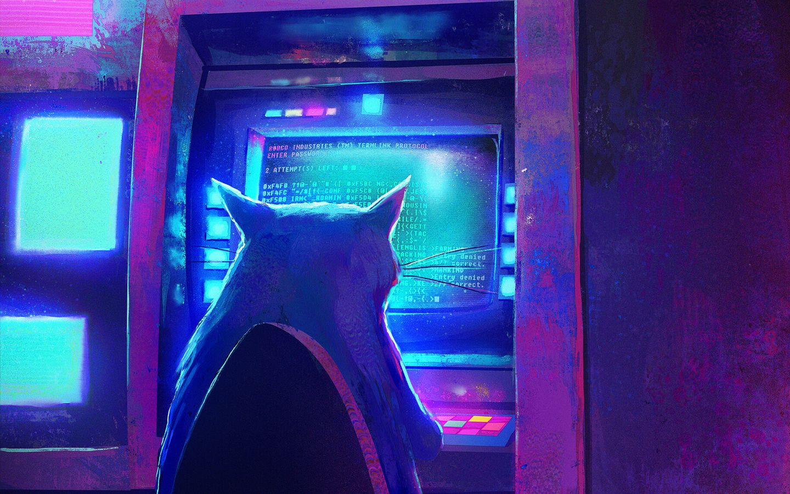

## Functional languages learning resources (mostly JVM + Apache Kafka et consortes)

### Scala:

* Scala (including Haskell and math): https://niqdev.github.io/scala-fp/docs/book.html
* Scala et consortes: http://writeonly.pl/
* [Alvin Alexander's page](https://alvinalexander.com/), author of books on Scala and functional programming
* Tutorials (including free basics) https://rockthejvm.com/
* Li Haoyi's [blog](http://www.lihaoyi.com/) and his book [Hands-on Scala Programming](https://www.handsonscala.com/)
* [Intro to Apache Spark for Java and Scala Developers - Ted Malaska (Cloudera)](https://www.youtube.com/watch?v=x8xXXqvhZq8)
* [2019 - Patryk Pilarski - Apache Spark vs Machine Learning](https://www.youtube.com/watch?v=Ai8MdBKeHgc)
* [@inline and @specialized: What do they do? Should I be using them? - by Chris Birchall](https://www.youtube.com/watch?v=WTeDaM3CC1I)

### Kafka (data streaming platform that uses both Scala and Java):

* [Apache Kafka](https://kafka.apache.org/)
* [Apache Kafka and KSQL in Action : Let’s Build a Streaming Data Pipeline! by Robin Moffatt](https://www.youtube.com/watch?v=RJtEacDX4Oc)
* ["EoS in Kafka: Listen up, I will only say this once!" by Jason Gustafson](https://www.youtube.com/watch?v=WscozkoXLHM)
* [Everything You Always Wanted to Know About Kafka’s Rebalance Protocol but Were Afraid to Ask (Matthias J. Sax)](https://www.confluent.io/kafka-summit-lon19/everything-you-wanted-to-know-kafka-afraid)
* [Building Streaming Microservices with Apache Kafka - Tim Berglund](https://www.youtube.com/watch?v=Hlb-Ss3q3as)
* [Martin Kleppmann | Kafka Summit London 2019 Keynote | Is Kafka a Database?](https://www.youtube.com/watch?v=BuE6JvQE_CY)
* [Event Sourcing You are doing it wrong by David Schmitz](https://www.youtube.com/watch?v=GzrZworHpIk)

### Clojure:

* Clojure and security researcher Paweł Wilk blog & Clojure manual: https://randomseed.pl/pub/poczytaj-mi-clojure/
* [Rozmowa Kontrolowana - Odcinek 53 - Paweł Wilk](https://www.youtube.com/watch?v=VRzovDRiTKk)
* Clojure dialect Babashka (Clojure scripting):
  - book https://book.babashka.org/
  - repo https://github.com/babashka

### Java

* Yong Mook Kim's website - Java and Spring: https://mkyong.com/
* [Baeldung](https://www.baeldung.com/)
* [4Developers 2018: Monady dla zwykłego Javowca (Jarek Ratajski)](https://youtu.be/8idt_VpS6XQ)
* [Devoxx - Functional Programming Patterns with Java8 with Victor Rentea](https://www.youtube.com/watch?v=F02LKnWJWF4)
* [Jarek Ratajski - Lambda Core – HardCore](https://www.youtube.com/watch?v=GTxXZ9Gb1Us)
* [Clean Lambdas - by Victor Rentea at JBCNConf'17](https://www.youtube.com/watch?v=qcIiufH_u7c)
* [Deep Learning: The Future of Artificial Intelligence, with Matthew Renze](https://www.youtube.com/watch?v=AktmFvRVPsI)
* [Project Loom: Fibers and Continuations for Java by Alan Bateman](https://www.youtube.com/watch?v=vbGbXUjlRyQ)
* [GeeCON Prague 2018: Edson Yanaga - Revisiting Effective Java in 2018](https://www.youtube.com/watch?v=6hoYTZglOOI)
* [GeeCON Prague 2018: Nitsan Wakart - Allocation - Mechanics, Profiling & Optimization](https://www.youtube.com/watch?v=rnHY7YJq1ps)
* [The Power and Practicality of Immutability by Venkat Subramaniam](https://www.youtube.com/watch?v=FQERMVABRrQ)
* [GeeCON Prague 2018: Miro Cupak - Pushing boundaries of types with modern Java](https://www.youtube.com/watch?v=sPKH02NIZ-4)
* [Jarek Ratajski - Dysfunctional DDD | Lambda Days 2019](https://www.youtube.com/watch?v=TmnTmt0WBKU)
* [Massive Parallelism with GPUs in Java (Adam Roberts)](https://www.youtube.com/watch?v=CIjdipU66qw)
* [Java, Today and Tomorrow by Mark Reinhold](https://www.youtube.com/watch?v=kpio9jFhpD8)
* [Quarkus - a next generation Java runtime (Michał Szynkiewicz)](https://www.youtube.com/watch?v=_PEc5CCKrtM)
* [Functional Programming with Java 8 by Venkat Subramaniam](https://www.youtube.com/watch?v=15X0qFtBqiQ)
* [Streams in Java 8: Reduce vs. Collect](https://www.youtube.com/watch?v=oWlWEKNM5Aw)
* [Angelika Langer's page - lambdas & generics](http://www.angelikalanger.com/Lambdas/Lambdas.html)
* [Why Java and the JVM Will Dominate the Future of Machine Learning, AI, and Big Data](https://www.youtube.com/watch?v=Ytja2JuVMlw)
* [Derek Ferguson — Machine learning in Java from nothing to production in one hour](https://www.youtube.com/watch?v=ljuf1mYqAIE)

### Groovy

* Groovy and Java: https://www.mrhaki.com/

---

*All resistance is fur-til. You will become a function.*

